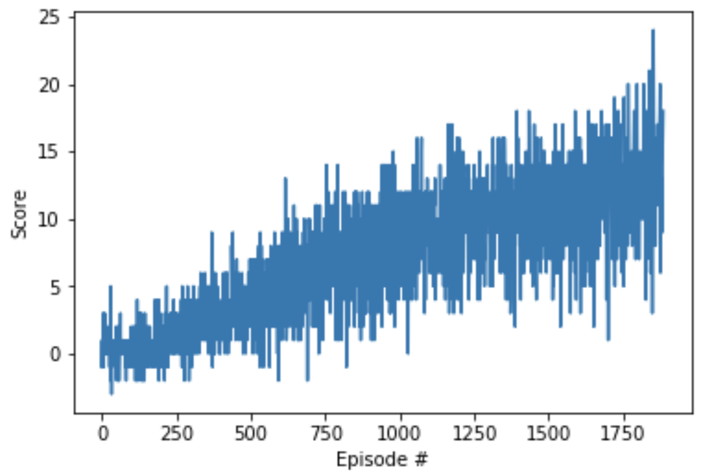

# DRL_Nanodegree_Navigation_Project
First Project "Navigation" for the Udacity Nanodegree "Deep Reinforcement Learning"

## Benchmark Implementation

If you're interested in about how long it should take, in the solution code for the project, we were able to solve the project in fewer than 1800 episodes.

