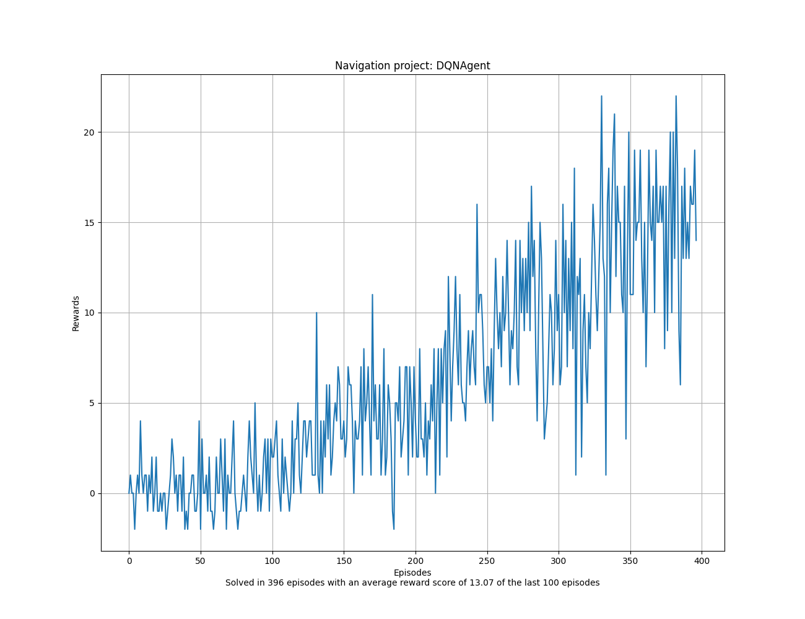
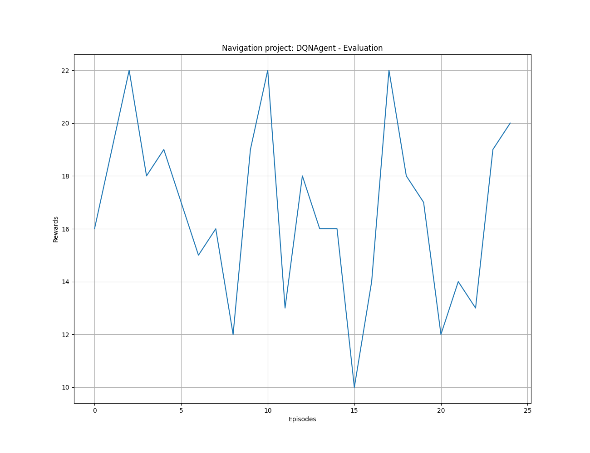
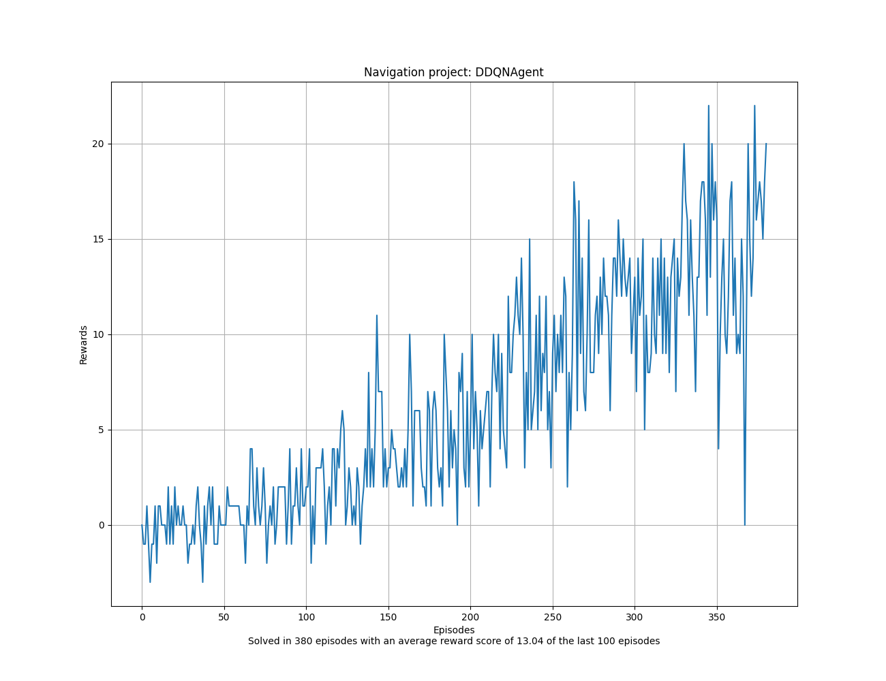
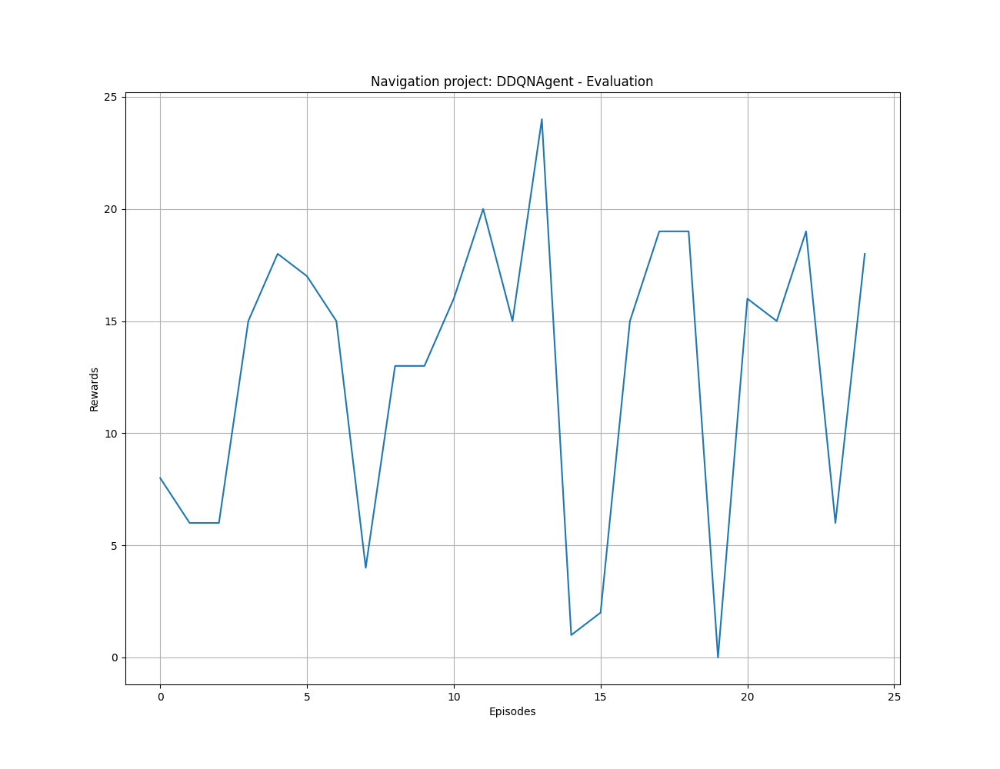
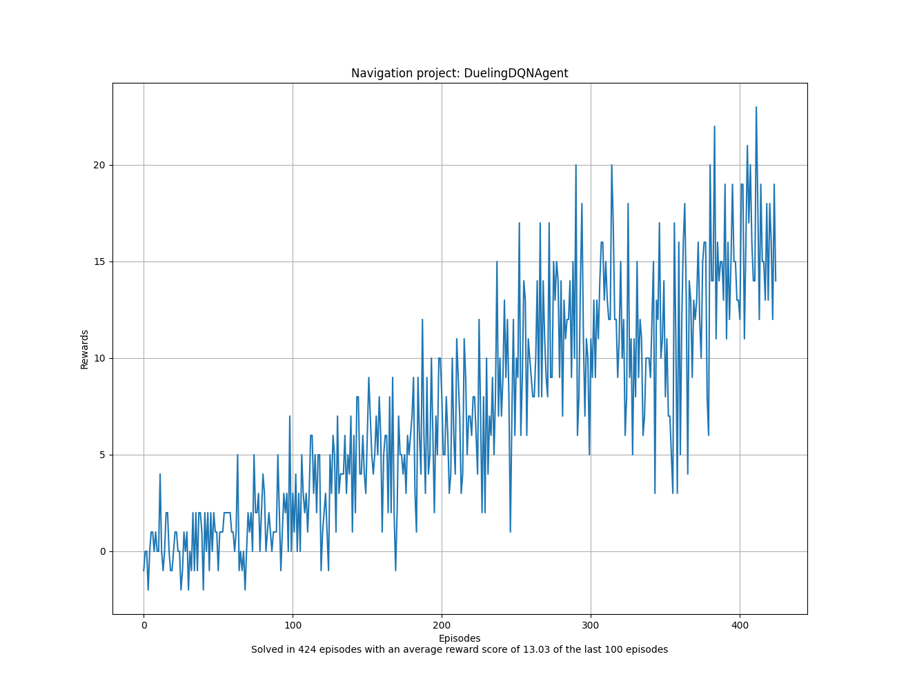
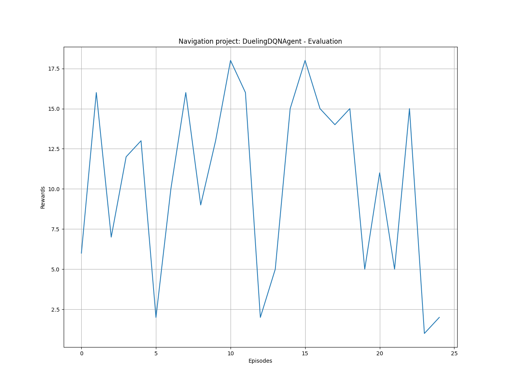
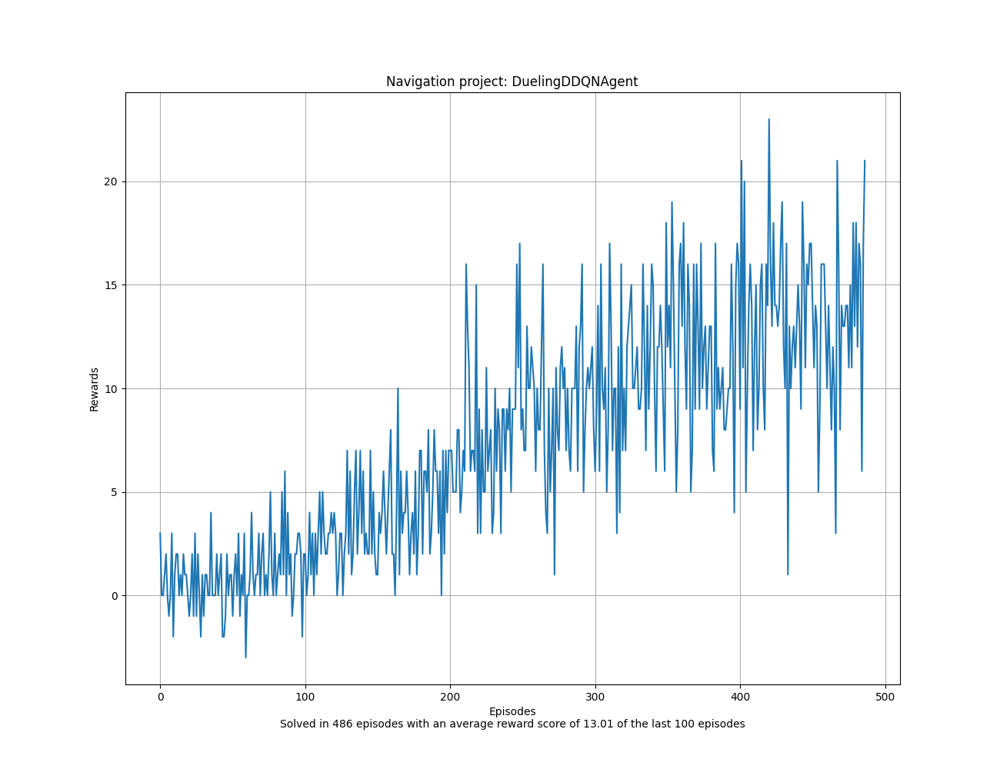
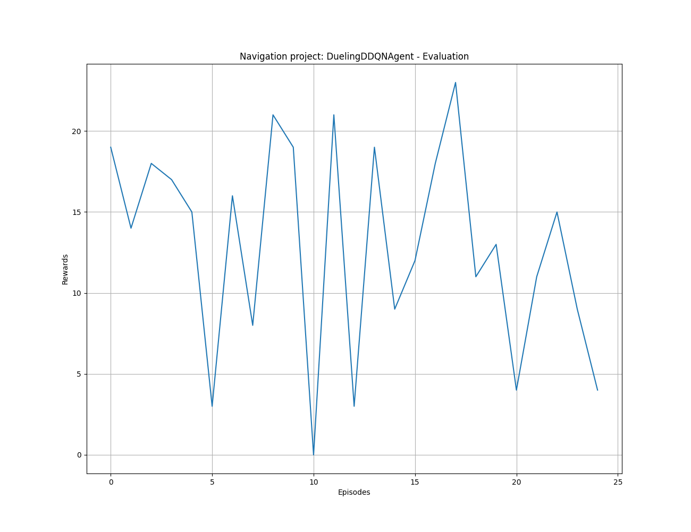

# Project report:  Navigation

## Project structure

The code is structured in the following way:

- ``main.py``: This file contains the main code to train and test the agent from the command line using Argparse. It is possible to train the agent from scratch or load a pre-trained model. The code is also able to evaluate the agent in the environment in different modes, e.g. visual and non-visual mode. Please keep in mind that the visual mode is slower than the non-visual mode.
- ``src/agents.py:`` Contains the implementation of the different deep q-learning agents as follows:
    - ``Agent``: Base class for all agents
    - ``DQNAgent``
    - ``DoubleDQNAgent``
    - ``DuelingDQNAgent``
    - ``DuelingDoubleDQNAgent`` 

- ``src/replay_buffer.py:`` Contains the implementation of the replay buffer that is used by the agents.

- ``src/networks.py:`` Contains the implementation of two different neural networks that are used by the agents. The first one is a simple fully connected network called ``DeepQNetwork`` with Relu activations, MSELoss and RMSprop optimizer. The second one is a convolutional neural network with Relu activation, MSELoss and RMSprop optimizer. The other network called ``DuelingDeepQNetwork`` is an extension of the ``DeepQNetwork`` that uses a dueling architecture, i.e., it splits the network into two streams, one for the state value function and one for the advantage function. Both of them are simple fully-connected layers. The final Q-values are computed by combining the state value function and the advantage function.

## Learning algorithm

- Implementation details of: Replay Buffer, inheritance structure of agents, DQN, Double DQN, 
- Give chosen hyperparameters

## Plot of rewards

Every algorithm was able to solve the navigation problem with an average score of 13+ over 100 consecutive episodes. See the following plots for the training and evaluation of the different DQN algorithms.

### Deep Q-Learning (DQN)

Training plot of the **DQN algorithm**: 

Evaluation of the trained **DQN agent** over 25 episodes with deterministic behavior:

### Double Deep Q-Learning (DDQN)

Training plot of the **DDQN algorithm**: 

Evaluation of the trained **DDQN agent** over 25 episodes with deterministic behavior:

### Dueling Deep Q-Learning (Dueling DQN)

Training plot of the **Dueling DQN algorithm**: 

Evaluation of the trained **Dueling DQN agent** over 25 episodes with deterministic behavior:

### Dueling Double Deep Q-Learning (Dueling DDQN)

Training plot of the **Dueling Double DQN algorithm**: 

Evaluation of the trained **Dueling Double DQN agent** over 25 episodes with deterministic behavior:

## Ideas for future work

- Incorporating Prioritized Experience Replay. See the following paper: [Prioritized Experience Replay](https://arxiv.org/abs/1511.05952)
- Incorporating hyperparameter optimization using random search, grid search and Hyperband. See the following paper: [Hyperband: A Novel Bandit-Based Approach to Hyperparameter Optimization](https://arxiv.org/abs/1603.06560)